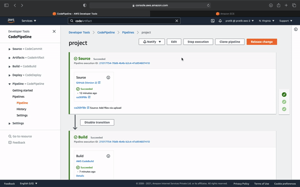
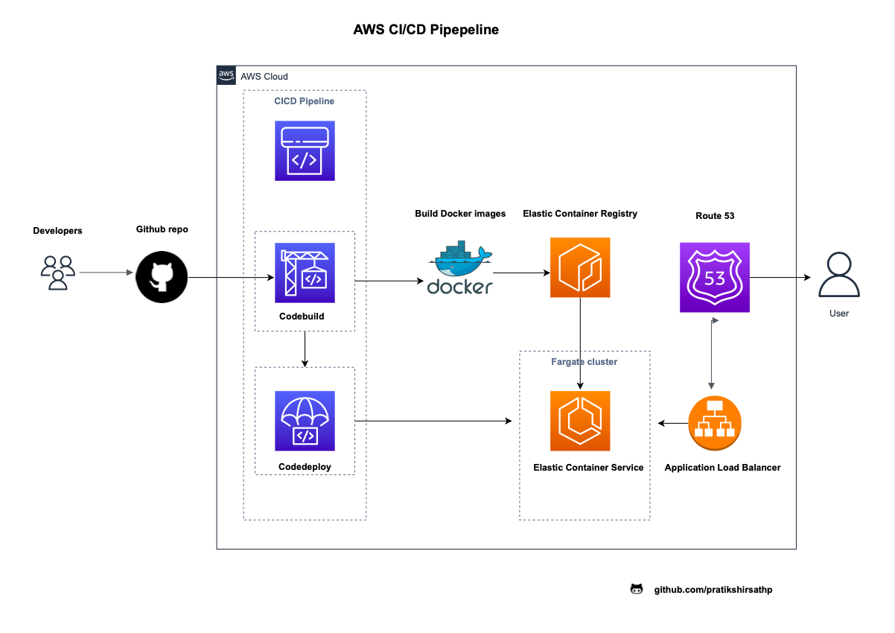

<h1 style="color:blue;">AWS CI/CD PIPELINE </h1>

There are three stages in this particular pipeline :

  Source :  a repository where we store all code files for the app 
            any version control application could be used.
            Example Github, AWS codecommit
            
  Build  : In build stage we use AWS codebuiild, it builds docker images, 
           using instriction we provided in YAML file
  
  Deploy : we can use aws code deploy or Elastic container service(ECS) clusters using fargate

AWS Services used :

    Elastic container registry(ECR) : AWS manages Docker container registry, used to store and deploy Docker container; 

    Elastic container service(ECS). : Fully managed container service that helps deploying, managing, and scaling containerized applications

    AWS Codebuild                   : It builds docker images

    Aplication Load Balancer(ALB).  : To Distribute the traffic
    
    Identity and access management(IAM) : asssigning IAM roles for AWS services
    

<h2> Architecture : </h2>

  

